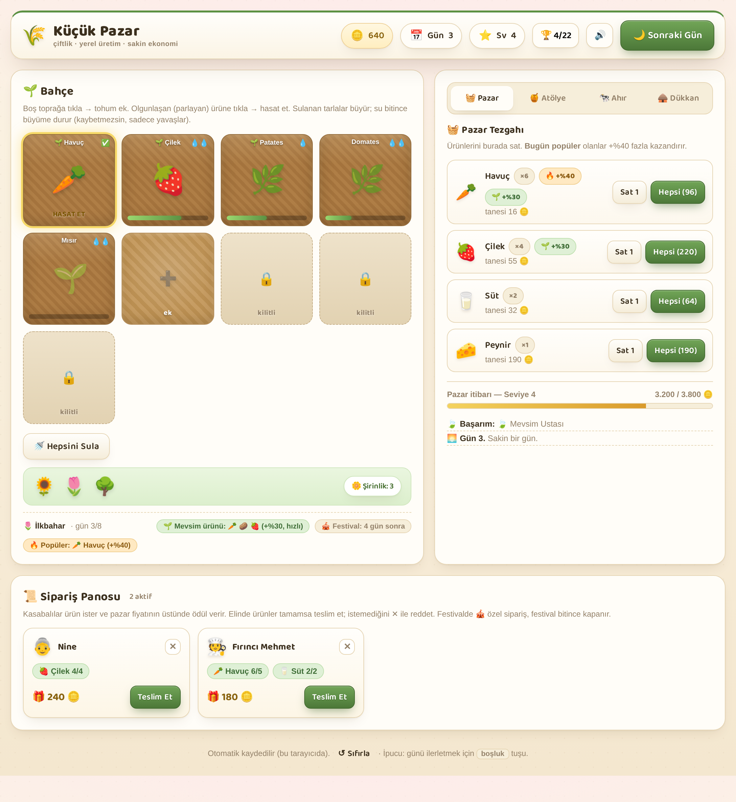

# 🌾 Küçük Pazar — Cozy Çiftlik & Yerel Üretim Oyunu

Sakin (cozy) bir tycoon prototipi. Rekabet yok, zaman baskısı yok, kaybetme durumu yok —
sadece huzurlu bir ekonomi büyütme döngüsü: **yetiştir → hasat et → işle → pazarda sat → büyü.**

Tek dosya, bağımlılıksız. `index.html`'i tarayıcıda aç, hemen oynanır. İlerleme tarayıcıya
otomatik kaydedilir (localStorage).

> **`sandbox.html`** — "her şey açık" keşif sürümü: tüm tarlalar, yükseltmeler, ahır ve süsler
> açık, 50.000 altın ve maksimum seviye ile başlar. Ayrı bir kayıt anahtarı (`kucuk_pazar_sandbox_v1`)
> kullanır, yani normal oyundaki ilerlemene dokunmaz. `index.html`'den türetilir (bkz.
> `tools/make-sandbox.mjs` mantığı: başlangıç durumunu açar + kayıt anahtarını değiştirir).

## Oynanış

1. **🌱 Bahçe** — Boş toprağa tıkla, tohum ek. Tarlalar sulandıkça birkaç gün içinde büyür.
   Olgunlaşan (parlayan) ürüne tıklayıp hasat et. Su biterse büyüme _durur_ ama bir şey
   kaybetmezsin; sadece yavaşlar.
2. **🌙 Sonraki Gün** (veya `boşluk` tuşu) — Zaman ilerler, ürünler büyür, atölye üretimi ve
   ahır ürünleri teslim edilir, her gün farklı bir ürün "popüler" olur (+%40 satış), mevsim
   ilerler (her 8 gün: İlkbahar → Yaz → Sonbahar → Kış).
3. **🧺 Pazar** — Ham ürünleri (tarla + hayvan) ve işlenmiş malları sat.
4. **🍯 Atölye** — Mutfak aldıktan sonra ham ürünleri çok daha değerli ürünlere işle
   (buğday→ekmek, domates→sos, yaban mersini→reçel, üzüm→şarap, süt→peynir, yumurta→kek...).
5. **🐄 Ahır** — Ahır alınca tavuk/inek/koyun besle; beslenen hayvanlar zamanla yumurta 🥚,
   süt 🥛, yün 🧶 verir. Yem olarak buğday (yoksa altın) harcanır — tarla ve ahır birbirine bağlı.
6. **📜 Sipariş Panosu** — Kasabalılar (Fırıncı, Nine, Küçük Ali...) belirli ürünler ister ve
   pazar fiyatının **üstünde** ödül verir. Elinde ürünler tamamsa "Teslim Et"; istemediğin
   siparişi ✕ ile reddet. Süre sınırı ve ceza yok — sadece hoş bir hedef.
7. **🛖 Dükkan** — Kazancı çiftliğe yatır: yeni tarla, mutfak, otomatik sulama, şirin tezgah
   (+%15 fiyat), ahır, otomatik yemlik, şaraphane (premium ürünler) ve **bahçe süsleri**.

### 🌱 Mevsimler & fiyat dalgalanması

- **Mevsim ürünü:** Her mevsim bazı ürünler "mevsimindedir" → **+%30 satış** ve **1 gün hızlı
  büyüme** (İlkbahar: havuç/patates/çilek · Yaz: domates/mısır/yaban mersini · Sonbahar:
  buğday/üzüm/balkabağı). Mevsim dışı ürün **cezasız**, sadece bonus almaz.
- **Kış = pazar mevsimi:** Kışın hiçbir ürün mevsiminde olmaz; bunun yerine **hayvan ürünleri
  ve işlenmiş mallar +%15** ("kış talebi"). Yani sıcak mevsimlerde yetiştir, kışın işle & sat.
- **🎪 Pazar Festivali:** Her mevsimin **son 2 günü** festivaldir → **tüm satışlar +%50** ve
  panoda büyük ödüllü bir **festival siparişi** (Festival Komitesi) açılır. Festival bitince
  özel sipariş kapanır (kaçırmak cezasız). Stok yapıp doğru anda satmaya değer bir ritim.
  Mevsim şeridi festivale geri sayım gösterir; festivalde üst bar pembe parıltıyla işaretlenir.
- **Şeffaf fiyat:** Nihai fiyat `taban × tezgah × mevsim × festival × popüler` — pazar
  satırındaki çipler hangi bonusun geçerli olduğunu gösterir (🔥 popüler, 🌱 mevsim, ❄️ kış,
  🎪 festival). Ekim menüsü ve tarlalar da mevsim ürünlerini 🌱 ile işaretler.

Toplam kazancın **Pazar itibarı** seviyeni yükseltir; her seviye yeni tohum, hayvan ve
olanaklar açar. **🏆 Başarımlar** (22) ve **🌼 Şirinlik** (süslerle artan) ilerlemene eşlik eder.

## Cila katmanı

- **🔊 Ses:** Web Audio ile üretilen efektler (ekim, hasat, altın, satın alma, gün, seviye,
  başarım) — harici dosya yok, aç/kapat düğmesi kayıtlı.
- **✨ Animasyon:** ekim/hasat sıçraması, uçuşan +N / +altın yazıları, hazır tarla nabzı,
  fide sallanması, seviye ışıltısı.
- **🌷 Dekorasyon:** satın alınabilir bahçe süsleri, mevsime göre değişen gök rengi ve düşen
  parçacıklar (çiçek/kelebek/yaprak/kar).
- **🏆 Başarımlar:** kilitli/açık ızgara modalı, açılışta bildirim + ses.

Tümü `prefers-reduced-motion` açık olduğunda ağır animasyonları otomatik kısar.

## Tasarım felsefesi (cozy)

- **Baskı yok:** timer yok, enerji/açlık yok, oyun bitmez.
- **Yavaş ve tatmin edici döngü:** her gün küçük ilerleme, ara sıra komşu hediyesi.
- **Derinlik seçeneği:** ham satış kolay yol; işleme (atölye) ve ahır kârı katlar ama planlama ister.
- **Kaldığın yerden devam:** tarayıcı kapansa da ilerleme durur.

## Görsel tasarım

Sıcak, cozy bir görsel kimlik: başlık/butonlar/rakamlar için gömülü **Baloo 2** (yuvarlak,
karakterli display fontu — Türkçe alt kümesiyle base64 olarak gömülü, harici istek yok), gövde
metni için sistem fontu. Yeşil aksanlı üst bar, katmanlı yumuşak gölgeler, sürülmüş toprak
dokulu tarlalar, "şeker buton" hissi ve mevsime göre değişen gök rengi. Tümü CSP-güvenli.

## Teknik

- Saf HTML/CSS/JS (vanilla), harici bağımlılık yok — çevrimdışı çalışır, CSP-güvenli.
- Durum `localStorage` (`kucuk_pazar_v1` anahtarı) üzerinden kaydedilir; şema geriye dönük uyumlu.
- İçerik veri-odaklı (`CROPS`, `APROD`, `ANIMALS`, `GOODS`, `UPGRADES`, `DECOR`, `CUSTOMERS`,
  `ACHIEVEMENTS`, `LEVELS`) — yeni ürün/hayvan/tarif/müşteri/başarım eklemek kolay.

## Sonraki adımlar (fikirler)

- Arı kovanı → bal, ek hayvan/ürün çeşitleri
- Ekonomi denge ayarı ve zorluk eğrisi
- Siparişlerde mevsim temalı özel istekler ve seri bonusları
- "Koleksiyon defteri" ve mevsim temalı festival varyasyonları
